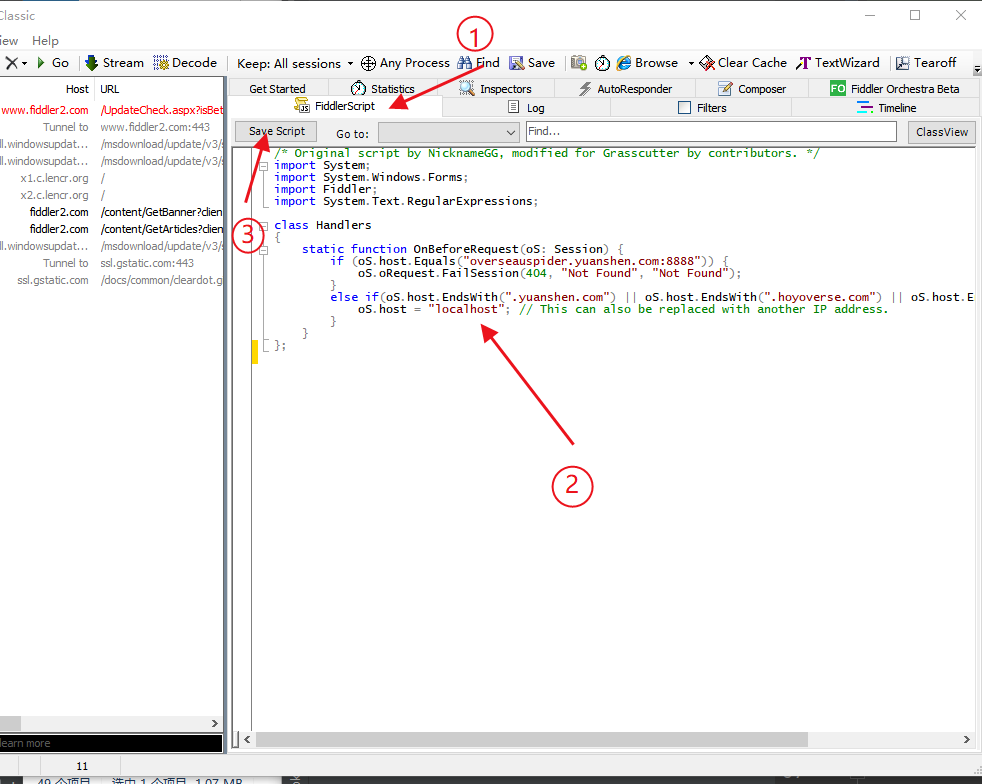

# Grasscutter Docker

> **3.3 is not currently supported (目前不支持3.3!!)**

Run [Grasscutter](https://github.com/Grasscutters/Grasscutter)  on Docker

## Run sever （运行服务）

```shell
git clone https://github.com/gojuukaze/Grasscutter_Docker.git
docker pull gojuukaze/grasscutter:v3.2-20221203
cd Grasscutter_Docker

cd run
docker-compose up -d --build
```

## Restart sever  （重启服务）

```shell
cd run
docker-compose up -d

# If the image has updates, add -- build
# 如果镜像有更新要添加 --build
```


## Stop sever （停止服务）

```shell
cd run
docker-compose stop
```

## Create user (创建用户)

```shell

docker exec -it grasscutter bash

# Enter the command interface
# 进入命令界面
screen -r app
account create username 1
account resetpass username password


# give items (给用户发送物品)
# ！！！ This command can only be executed after running the game and logging in ！！！
# ！！！ 这个命令只有运行游戏并登录，且可以控制人物后才能执行
# read https://github.com/Grasscutters/Grasscutter/wiki/Commands#give-command

give @1 223 100 # 给id为1的用户100个纠缠之缘
give all x10  # 给所有物品10个

```
* !! To exit from screen, press `ctrl-a-d` . You cannot use `ctrl-c`
* !! 从screen下退出要同时按下 `ctrl-a-d` ，不能使用 `ctrl-c`

> item id : https://github.com/jie65535/GrasscutterCommandGenerator/tree/main/Source/GrasscutterTools/Resources

## Run client （运行游戏）

1. download `UserAssembly.dll` （下载dll文件）
   * International （国际服）：https://cdn.discordapp.com/attachments/969297345240006736/1037131564666068992/UserAssembly32_patched.zip
   * China（国服）: https://drive.google.com/file/d/1EoFBaw9BWkOX3cIT06mqs5Qy5rSOD0Rj/view
   * Download from release: https://github.com/gojuukaze/Grasscutter_Docker/releases/
   * Search on discord: https://discord.gg/grasscutter

2. Go to `the game path\Genshin Impact game\GenshinImpact_Data\Native\` and backup the `UserAssembly.dll` then move the one you downloaded above and renamed into that folder.  
   (进入上面这个游戏目录，备份 `UserAssembly.dll` ，并用下载的文件替换它 )

3. download `Fiddler Classic`  https://www.telerik.com/download/fiddler ，Route all traffic going to HoYoVerse/MiHoYo servers to the server host.  
  （下载 `Fiddler Classic` 并代理请求）

     
   
   .
   
   

   copy and paste the script in the FiddlerScript tab and click the Save Script button (复制下面脚本到FiddlerScript并保存)
   ```java
   /* Original script by NicknameGG, modified for Grasscutter by contributors. */
   import System;
   import System.Windows.Forms;
   import Fiddler;
   import System.Text.RegularExpressions;
   
   class Handlers
   {
       static function OnBeforeRequest(oS: Session) {
           if (oS.host.Equals("overseauspider.yuanshen.com:8888")) {
               oS.oRequest.FailSession(404, "Not Found", "Not Found");
           }
           else if(oS.host.EndsWith(".yuanshen.com") || oS.host.EndsWith(".hoyoverse.com") || oS.host.EndsWith(".mihoyo.com")) {
               oS.host = "localhost"; // This can also be replaced with another IP address.
           }
       }
   };
   ```
   

4. Run Game （运行游戏）
